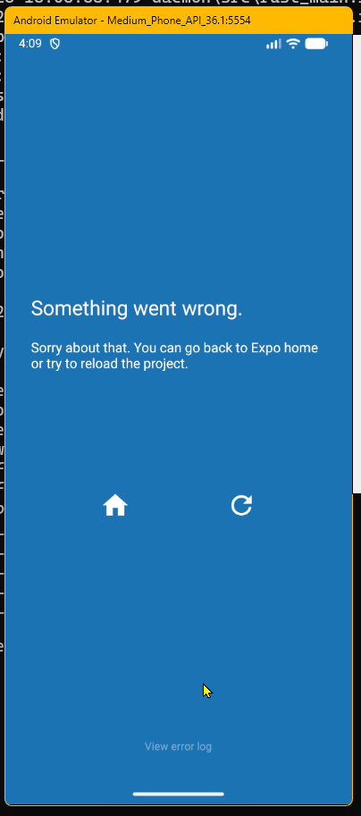
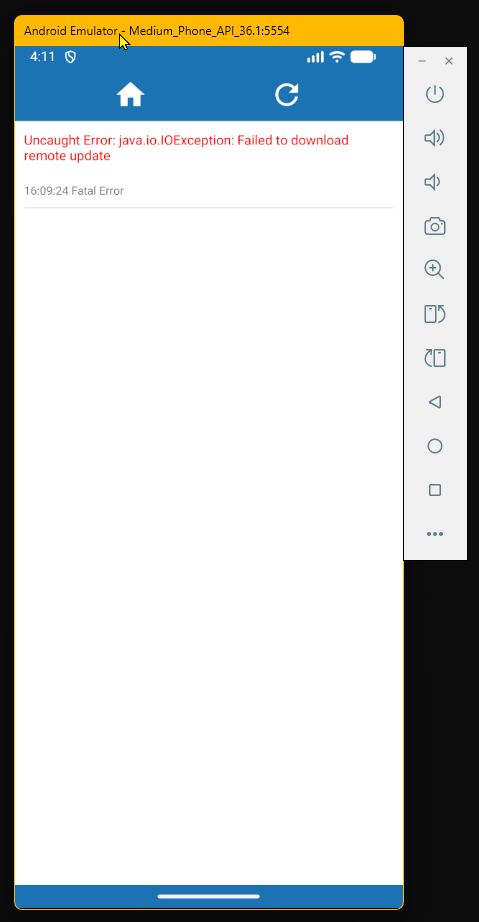

# Setup do ambiente

Resumo das instruções do artigo [React Native Expo Installation in Windows 11](https://karuppan-the-pentester.medium.com/react-native-expo-installation-in-windows-11-f3e8a28c30ec)

## Instalação do CLI do Expo

```bash
npm install expo-cli --global
```

## Inicialização do projeto

```bash
npx expo start -c
```

O parâmetro `-c` (ou `--clear`) limpa o cache do `bundler`.

## No dispositivo mobile, efetuar o download do aplicativo Expo Go.

Para Android: [Expo Go para Android](https://play.google.com/store/search?q=Expo%20go&c=apps&hl=pt_BR)

Para iOS: [Expo Go para iOS](https://apps.apple.com/br/app/expo-go/id982107779)

## Instruções para configuração do Android Studio

[Android Studio Emulator](https://docs.expo.dev/workflow/android-studio-emulator/)

## Problemas de conexão com o Android Studio Emulator no Windows

Caso encontre problemas de conexão com o Android Studio Emulator como o que aparece na imagem abaixo, considere usar o IP do seu computador ao invés do endereço exp://127.0.0.0.1:8081. 

```
exp://${your_ip}:8081
```

Para obter o IP, entre em um terminal e digite o comando [`ipconfig`]([text](https://www.oficinadanet.com.br/windows/25200-como-e-quando-usar-o-ipconfig-no-windows)) e copie o IP v4 que aparece lá.

**Figura 1:** Erro ao abrir a aplicação usando o Expo no Android Emulator





**Figura 2:** Mensagem de erro apontando o detalhe que originou o erro




Para maiores detalhes, veja o post a seguir do Stack Overflow:

[Uncaught Error: java.io.IOException: Failed to download remote update](https://stackoverflow.com/questions/79332816/uncaught-error-java-io-ioexception-failed-to-download-remote-update/79366409#79366409)
